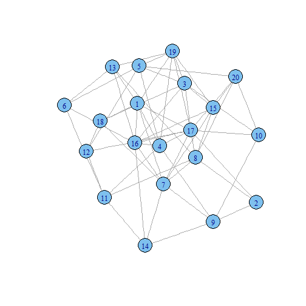

## What is Erdos-Renyi Random Graph?

In graph theory, the Erdos-Renyi model is either of two closely related models for generating random graphs, including one that sets an edge between each pair of nodes with equal probability, independently of the other edges.

--- .class #id

## Definition

- In the G(n, M) model, a graph is chosen uniformly at random from the collection of all graphs which have n nodes and M edges. For example, in the G(3, 2) model, each of the three possible graphs on three vertices and two edges are included with probability 1/3.

- In the G(n, p) model, a graph is constructed by connecting nodes randomly. Each edge is included in the graph with probability p independent from every other edge. Equivalently, all graphs with n nodes and M edges have equal probability of
$p^M (1-p)^{{n \choose 2}-M}$.
The parameter p in this model can be thought of as a weighting function; as p increases from 0 to 1, the model becomes more and more likely to include graphs with more edges and less and less likely to include graphs with fewer edges. In particular, the case p = 0.5 corresponds to the case where all $2^\binom{n}{2}$ graphs on n vertices are chosen with equal probability.

--- .class #id

## Using iGraph to create and visualize random graphs in R


```r
library(igraph)

g <- erdos.renyi.game(20, .3, type=c('gnp'),
                     directed = FALSE, loops = FALSE)

layout1 <- layout.fruchterman.reingold(g)
plot(g, layout=layout1)
```

--- .class #id

## Plot created using igraph

 

--- .class #id

## Plot created using igraph

You can access the interactive demo at:

<a href="http://tg-datascience.shinyapps.io/dataproduct_peer_review">http://tg-datascience.shinyapps.io/dataproduct_peer_review</a>

--- .class #id

## Thanks for watching 

--- .class #id
